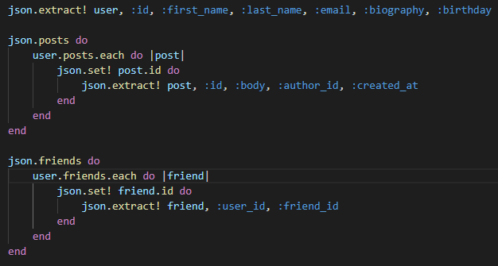
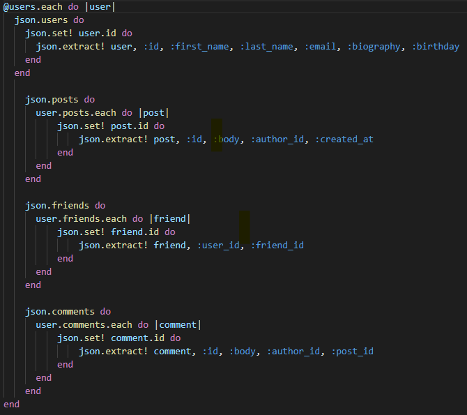
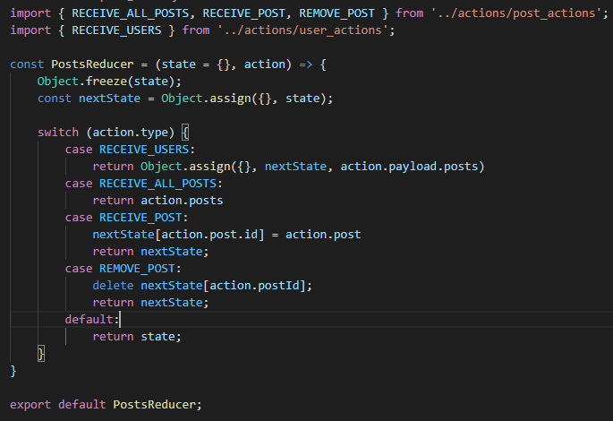

# SocialNetwork 

SocialNetwork is a clone of Facebook. Like Facebook, the purpose of SocialNetwork is to allow users to connect with other users and friends. They can post, comment, friend eachother and do everything to stay connected to one another. 

### [Live link](https://social-network0.herokuapp.com/#/)

## Features

----------------------------------------------------------------------------------

### User Auth

-----------------------------------------------------------------------

Users can sign in and sign up. On the splash page there is an initial sign in form. On the sign in form there is a sign up button which opens up a modal containing the sign up form. Like Facebook I added errors which will make the border of an input red if there is a missing field. I decided to show the errors at the top of the form as opposed to redirecting the user to another page which would have required me to make another api endpoint.

### Comments/Posts

--------------------------------------------------------------------------------

Users are able to make posts and comment on posts. All posts will show up on the home page for everyone to see. With the use of react and some javascript I was able to nest a post's respective comments so all posts will show their respective comments. 

### Profile

---------------------------------------------------------------------------

Upon creating an account users will have a profile page dedicated to themselves. On this profile page there will be information about the user, only the user's posts, and show all the user's friends. Using jbuilder I was able to get all posts in the state when I get all the users, and using a bit of javascript I was able to filter out all the relevant posts.

### Friends

-------------------------------------------------------------------------------

A user is able to add another user as a friend with the click of a button. Users may view all their friends, and all users that are not the user's friend will show up as suggested friends. 

### User Feeds

-------------------------------------------------------------------------------------

The homepage of the website is where all of the posts will be. Here a user can create a post if they please or look at my shameless ads.

## Technologies

----------------------------------------------------------------------

The following technologies were used for this project:

* Ruby on Rails: Backend
* React & Redux: Frontend
* PostgreSQL: Database
* HTML & CSS: Styling
* Webpack: Bundling and transpiling javascript code
* Node.js: Managing project dependencies

## Future

-------------------------------------------------------------

* Friend requests
* More tailored posts on feeds
* Likes, replies
* Images, AWS
